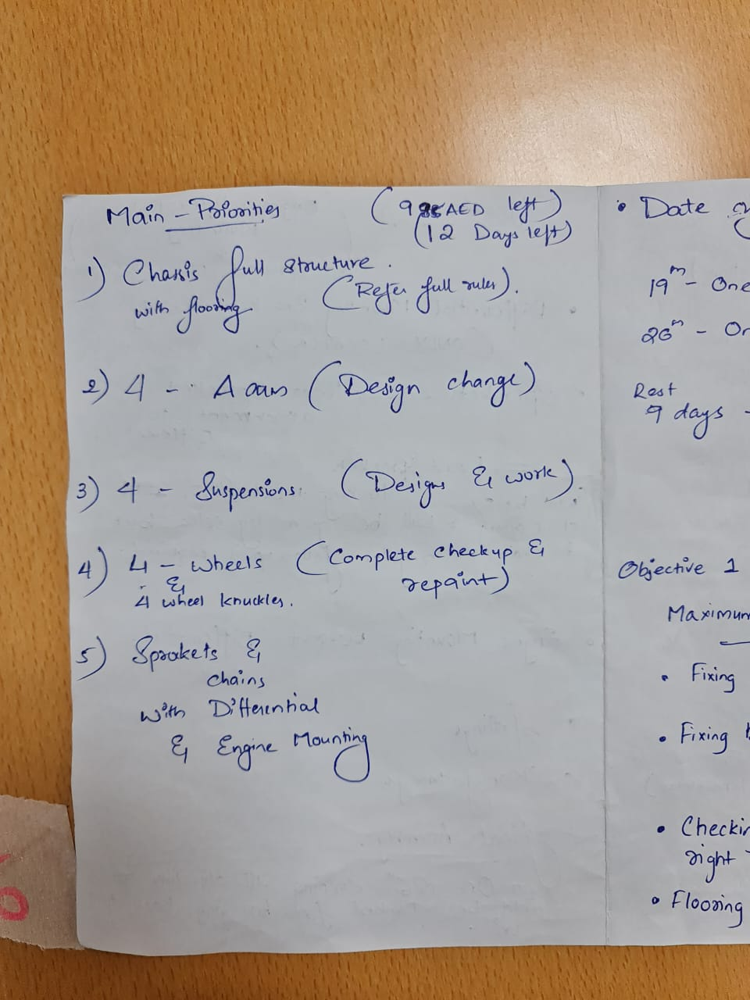

- [[Abhilash]]
	- I had to make all the calls today since, [[Garima]] and [[Surya]] had uni today and couldn't do anything. I have decided to call [[Priyank]] sir tomorrow to make arrangements to get us the meeting room so that the team can make calls.
	- [[Peugeot]], will give us an answer by tomorrow.
	- [[Zlatko]] contacted, he wants to know details regarding the existing braking system, so that he can supply spare versions of the same, shobal has asked 3 days to figure that out.
- we got selected for netherlands
	- [[Shobal]] calculations
		- Pre registration deposit  
		  €200 - 835 dhs
		- Registration fee for 15 ppl including vat, 
		  €1850 + €166.5 - 8400dhs
		- Campsite fee 
		  €700 + €63 - 3180 dhs
		- Initial cost comes to 12,415dhs
		- Worst case 13,500dhs
	- We need appropriately 35k dhs further to complete our project, out of which we have 900dhs
- #meeting
	- [[Adhav]] sent
		- {:height 141, :width 100}
		- {:height 200, :width 100}
		- {:height 200, :width 100}
		- {:height 200, :width 100}
- [[Thahir]] temporary website for [[Feb 15th, 2022]]