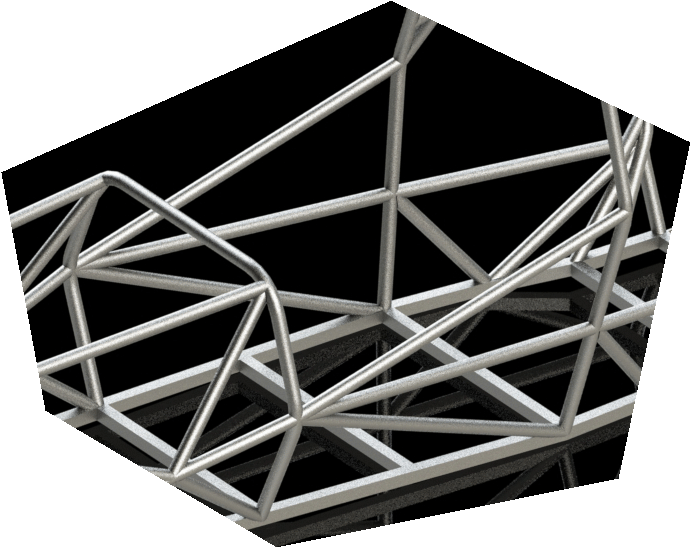

- DOING Modify part excel sheet
	- basically the inventory
- Plan Flowchart
	- Hover over the image and click the full screen button to see fully
	- 
- get the main items, then worry about backups and all
- Tasks
	- Overview
		- 
	- Rear
	  background-color:: #978626
		- 
		- attach differential, axles
		- attach rear suspension, wheels
		- design and attach exhaust system
		- intake system integration
		- Integrate cooling system
		- Fire extinguishing system
		- Engine Wiring with kill switch
		- Jack bar
	- Middle
	  background-color:: #793e3e
		- 
		- Fuel tank design, assembly, placement
		- Roll Hoop Padding
		- seat placement
		- firewall
		- lap belt and harness
		- steering wheel
		- sidepod design and assembly
	- Front
	  background-color:: #533e7d
		- 
		- Steering rack, tierods
		- Front suspension
		- tires, wheel hubs
		- front wiring
			- electrical
			- mechanical
		- Pedals
			- Brake
			- Clutch
			- Accelerator
		- IA
		- Front Body Panels