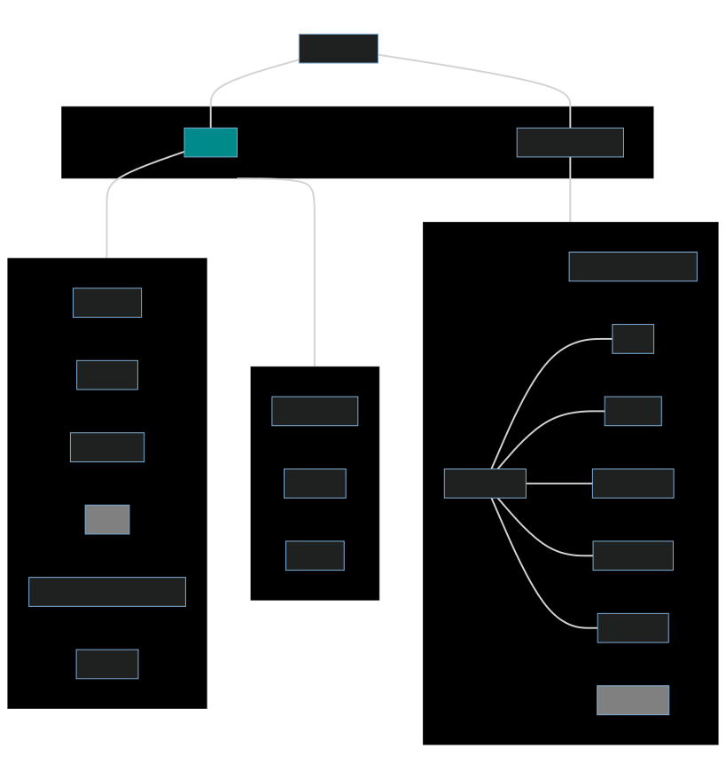

- # Phases
  collapsed:: true
	- |Semester|Internal Goal|External Goal|
	  |--|--|--|
	  |1|Design|Pre-Marketing|
	  |2|Prototype|Early-Buyers Pitch|
	  |3|Assembly|Contract Signing|
	  |4|Testing|More sponsors (if space available)|
	- By pre-marketing, we don't have to go around looking for potential sponsors at the time of assembly
- # Hierarchy
	- 
	- No board of sponsors, as they might cause an issue as their money is involved
	  collapsed:: true
		- If they really want to contribute, they can join board of mentors, but their opinions won't be considered as if they are a sponsor
	- Computer Students will work on using IOT to make our own dashboard
- # Activitities
  collapsed:: true
	- Credits to [[Priyank]]
	- Competitions
	  collapsed:: true
		- Competitions with groups $\le 3$
		- Price money of 100dhs
		- |Type|Fee|
		  |--|--|
		  |Member|-|
		  |Non-Member|10Dhs|
	- Weekly Group Watching
		- Drive to Survive
	- Talks
		- Alaudeen - Solar
		- Other teams